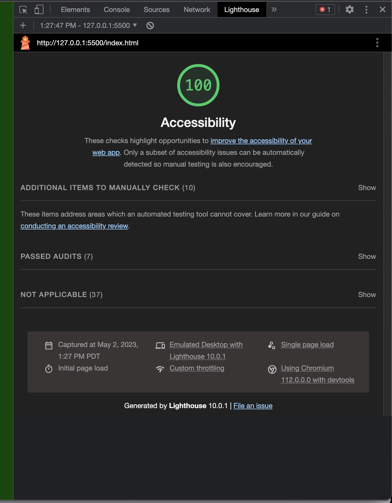
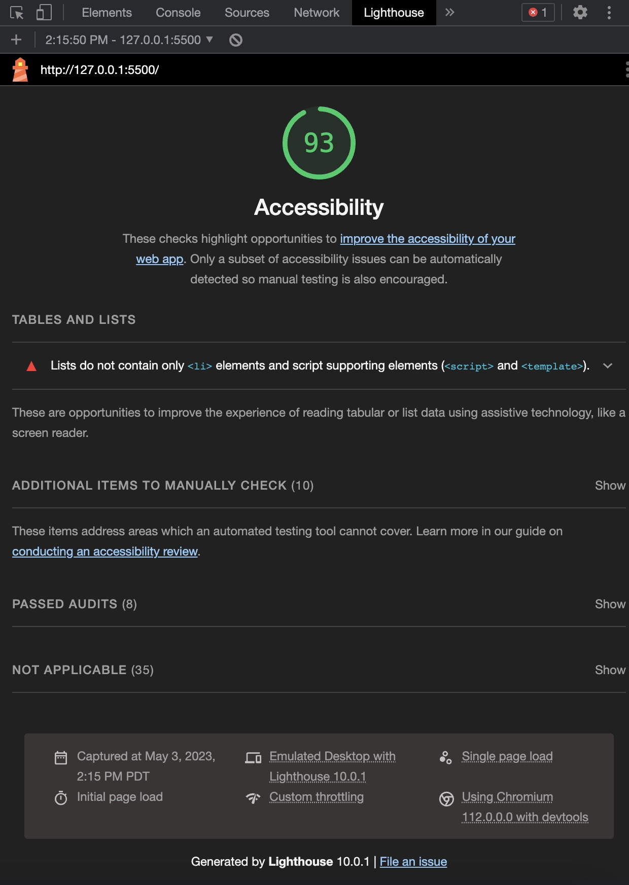

# about-me

# LAB - About Me

## Project Name: About Me

This lab goes through building a website about myself.  It incorporates basic HTML structure, linked CSS stylesheets, and basic Javiscript functionality.

### Author: Aaron Clark

### Links and Resources

* Any Links you used as reference

### Lighthouse Accessibility Report Score

* Provide a screenshot of your score after running a Lighthouse Accessibility report.  
  

### Reflections and Comments

- Null responses are not initially handled in my JS prompts.  In the future, I should add error handling that will accept when the user clicks cancel on a prompt.

___

### Collaboration:

- Functions added by Jon Stillson as the driver and Aaron Clark as the navigator.
